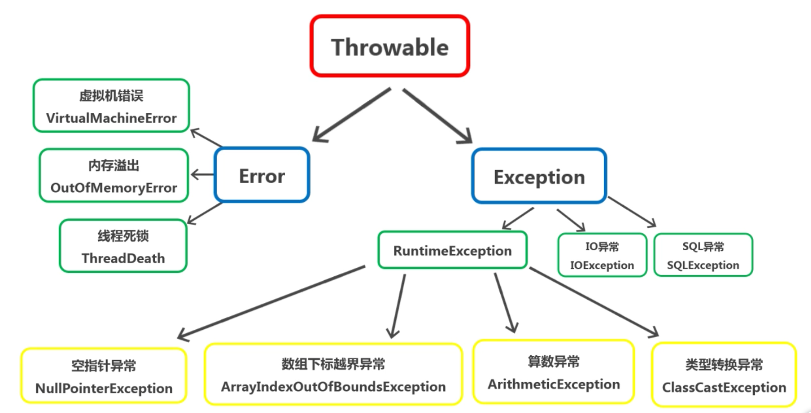
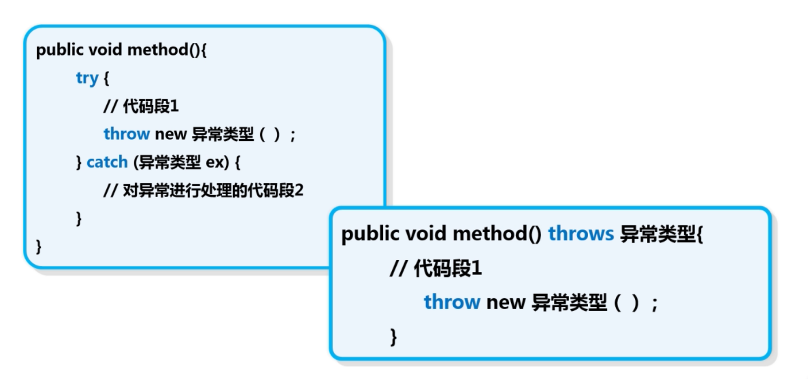

# Java异常
## 异常简介
### 异常 what？
 - 本质上是程序上的错误
 - 错误通常分为编译时期错误与运行时期错误
 - 在程序运行过程中，意外发生的情况，背离我们程序本身的意图的表现，都可以理解为异常。
### 异常分类
#### Throwable Java中异常的根类
1. Error 是程序无法处理的错误，表示运行应用程序中较严重问题
    - 常见错误，它们在应用程序的控制和处理能力之外，而且绝大多数是程序运行时不允许出现的状况
    - VirtualMachineError 虚拟机错误
    - OutOfMemoryError 内存溢出错误
    - ThreadDeath 线程死锁 
2. Exception 是程序本身可以处理的异常。异常处理通常针对这种类型异常的处理
    - Unchecked Exception 非检查异常
    - Chceked Exception 检查异常  
+ 
## 异常处理分类
- 异常处理机制 **抛出异常** **捕获异常**
- 通过5个关键词来实现：``try`` ``catch`` ``finally`` ``throw`` ``throws``
## 使用try...catch...finally实现异常
```
 try{
   //代码片段1
   //产生异常的代码段2
 }catch(异常处理 ex){
   //对异常进行处理的代码段3
 }finally{
   //代码段4
 }
```
- try块后可接零个或多个catch块，如果没有catch块，则必须跟一个finally块。
- 使用多重catch块
```
 try{
   //代码片段1
   //产生异常的代码段2
 }catch(异常处理 ex){
   //对异常进行处理的代码段3
 }catch(异常处理 ex){
   //对异常进行处理的代码段3
 }catch(Exception ex){
   //对异常进行处理的代码段3
 }finally{
   //代码段4
 }
```
- 终止finally执行的方法
```
System.exit(status);
```
- ``return``的使用  
finally语句中使用return，会强制返回return语句的内容
## 使用throw和throws实现异常
- 如果一个方法可能会出现异常，当没有能力处理这种异常，可以在方法声明处用throws子句来声明抛出异常
- throws语句用在方法定义时声明该方法要抛出的异常类型。
```
public void method() throws Exception1,Exception2,....ExceptionN{
  //可能产生异常的代码
}
```
- 当方法抛出异常列表中的异常时，方法将不对这些类型及其子类类型的异常进行处理，而是抛出调用该方法的方法，由它去处理
- 通过throws抛出异常时，针对可能出现的多种异常情况，解决方案：
    1. throws后面接多个异常类型，中间用逗号分隔
    2. throws后面接Exception
- throw用来抛出一个异常。
- 例如：throw new IOException();
- throw 抛出的只能够是可抛出类Throwable或者其子类的实例对象。
- 例如：throw new String("出错了");是错误的
- 
## 自定义异常
- 使用Java内置的异常类可以描述在编程时出现的大部分异常情况。
- 也可以通过自定义异常描述特定业务产生的异常类型。
- 所谓自定义异常，就是定义一个类，去继承Throwable类或者它的子类。
## 异常链
- 有时候我们会捕获一个异常后抛出另一个异常
- 将异常发生的原因一个传一个串起来，即把底层的异常信息传给上层，逐层抛出。
## 总结
- 在程序运行过程中，意外发生的情况，背离我们程序本身意图的表现，可以理解为异常。
- 利用Java中的异常机制，我们可以更好地提升程序的健壮性。
- 在Java中，通过Throwable及其子类描述各种不同的异常类型。
### 实际应用中的经验与总结
- 处理运行时异常时，采用逻辑去合理规避同时辅助try-catch处理
- 在多重catch块后面，可以加上catch（Exception）来处理可能会被遗漏的异常
- 对于不确定的代码，也可以加上try-catch，处理潜在的异常
- 尽量去处理异常，切忌只是简单的调用printStackTrace()去打印输出
- 具体如何处理异常，要根据不同的业务需求和异常类型去决定
- 尽量添加finally语句块去释放占用的资源