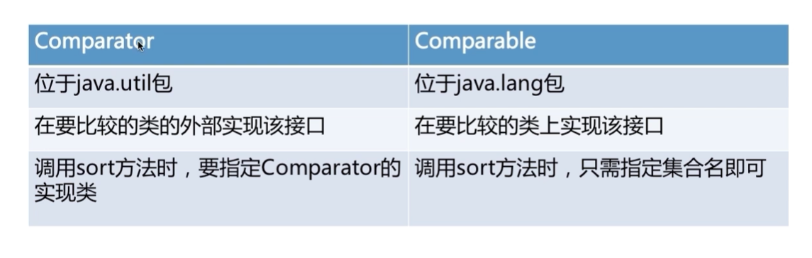

# 集合排序
- 集合中的基本数据类型排序
- 集合中的字符串排序
- Comparator接口
  - 强行对某个对象进行整体排序的比较函数
  - 可以将Comparator传递给sort方法（如Collections.sort 或 Arrays.sotr）
- Comparable接口
  - 此接口抢强行对实现它的每个类的对象进行整体排序
  - 这种排序被称为类的自然排序，类的compareTo方法被称为它的自然比较方法
  - 对于集合，通过调用Collections.sort方法进行排序
  - 对于数组，通过调用Arrays.sort方法进行排序
- 总结
- 