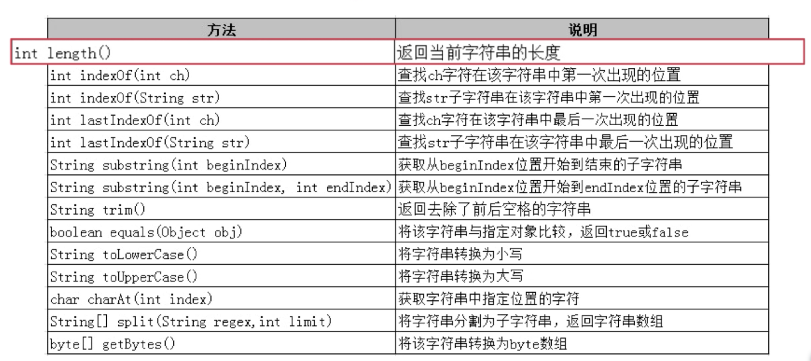

# 字符串
**String**与**StringBuilder**
## String常用方法
- 
```
String str = "Java basic demo";
		System.out.println(str.length());
		System.out.println(str.charAt(1));
		System.out.println(str.substring(5));
		System.out.println(str.substring(0,4));
		System.out.println(str.indexOf('a'));
		System.out.println(str.indexOf("basic"));
		System.out.println(str.lastIndexOf('a'));
		System.out.println(str.lastIndexOf("demo"));
```
- getBytes()方法
```
//将字符串转换成byte数组   getBytes 方法  
		String str = new String("JAVA biancheng 中文");
		byte[] arrs = str.getBytes("GBK");
		for(int i=0;i<arrs.length;i++) {
			System.out.print(arrs[i]+" ");
		}
		System.out.println();
		//将byte数组转换为字符串
		String str1 = new String(arrs,"GBK");
		System.out.println(str1);
		
		// == 与 equals 方法的区别
		String a = "java";
		String b = "java";
		String c = new String("java");
		System.out.println(a.equals(b));
		System.out.println(a.equals(c));
		System.out.println(a==b);
		System.out.println(a==c);
		// String 特性 不可变性 
		String s1 = new String("test");
		s1 = "hello"+s1;
		System.out.println(s1);
```
- StringBuilder  
- String 和 StringBuilder 的区别  
		String 具有不可变性，而StringBuilder不具备
- 当频繁操作字符串时，使用StringBuilder
- StringBuilder与StringBuffer 二者基本相似
- StringBuffer 线程安全，StringBuilder不是，所以性能略高
```
//StringBuilder
		
		StringBuilder str = new StringBuilder("hello");
		//添加方法
		str.append(',');
		str.append("world");
		System.out.println(str);
		//替换方法
		System.out.println(str.delete(7, 10).insert(7, "ORL"));
		System.out.println(str.replace(7, 10, "ORL"));
```