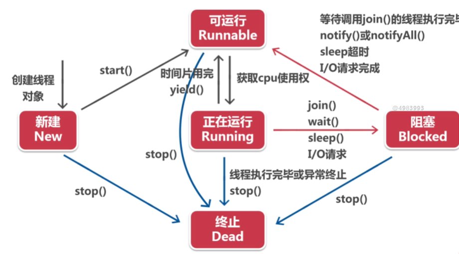
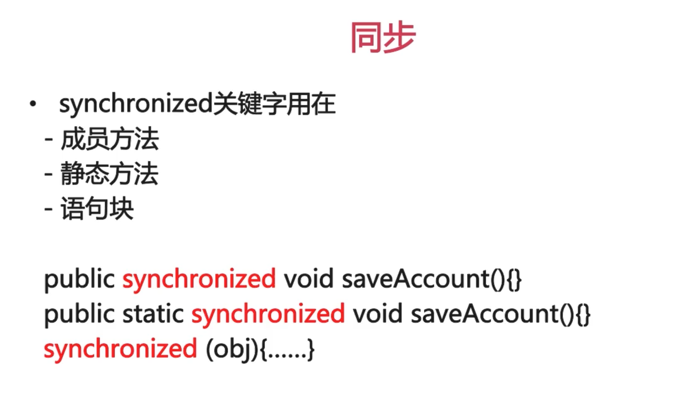

# 多线程
- 进程的概念  
进程是指可执行程序并存放在计算机存储器的一个指令序列，他是一个动态执行的过程；一般一个应用就是一个进程，如QQ等，但有些大型应用也会同时拥有几个进程

- 操作系统：  
  - 以前是单任务的，现在是多任务的，即可以同时执行多个进程
  - 程序在CPU里轮流运行，每次运行时间非常短，使用者察觉不到这种变化

- 线程的概念  
线程是比进程还要小的运行单位，一个进程包含多个线程；线程可以看做成一个子程序
- 生命周期
- 
- join方法
```
		Thread t = new Thread(lt);
		t.start();
		try {
			t.join();
		} catch (InterruptedException e) {
			// TODO Auto-generated catch block
			e.printStackTrace();
		}
```
- 线程的优先级
  - Java为线程类提供了10个优先级
  - 优先级可以用整数1-10表示，超出范围会抛出异常
  - 主线程优先级默认为5
- 优先级常量
  - MAX_PRIORITY:线程的最高优先级10
	- MIN_PRIORITY:线程的最低优先级
	- NORM_PRIORITY:线程的默认优先级5

## 多线程运行的问题
- 各个线程通过竞争CPU时间而获得运行机会的
- 各线程什么时候得到CPU时间，占用多久，是不可预测的
- 一个正在运行着的线程在什么地方被暂停时不确定的
- 需要将线程对象进行锁定
- 使用关键词synchronized实现
- 

## 线程之间的通信问题
```
package pers.java.weather;

public class Weather {
	private int temperture;
	private int humidity;
	private boolean flag = false;
	public int getTemperture() {
		return temperture;
	}
	public void setTemperture(int temperture) {
		this.temperture = temperture;
	}
	public int getHumidity() {
		return humidity;
	}
	public void setHumidity(int humidity) {
		this.humidity = humidity;
	}
	//生产天气  synchronized
	public synchronized void generate() {
		if(flag) {
			try {
				wait();
			} catch (InterruptedException e) {
				// TODO Auto-generated catch block
				e.printStackTrace();
			}
		}
		setTemperture((int)(Math.random()*40));
		setHumidity((int)(Math.random()*100));
		System.out.println("生成天气数据："+toString());
		flag = true;
		notifyAll();
	}
	//获取天气
	public synchronized void read() {
		if(!flag) {
			try {
				wait();
			} catch (InterruptedException e) {
				// TODO Auto-generated catch block
				e.printStackTrace();
			}
		}
		System.out.println("读取天气数据："+toString());
		flag = false;
		notifyAll();
	}
	@Override
	public String toString() {
		// TODO Auto-generated method stub
		return "[温度："+temperture+",湿度："+humidity+"]";
	}
}


```
```
package pers.java.weather;

public class GenerateWeather implements Runnable {
	Weather weather;
	GenerateWeather(Weather weather){
		this.weather = weather;
	}
	@Override
	public void run() {
		// TODO Auto-generated method stub
		for(int i = 0;i<100;i++){	
			try {
				Thread.sleep(5000);
			} catch (InterruptedException e) {
				// TODO Auto-generated catch block
				e.printStackTrace();
			}
			weather.generate();
		}
	}
	
}

```
```
package pers.java.weather;

public class ReadWeather implements Runnable {
	Weather weather;
	ReadWeather(Weather weather){
		this.weather = weather;
	}
	@Override
	public void run() {
		// TODO Auto-generated method stub
		for(int i = 0;i<100;i++){	
			try {
				Thread.sleep(100);
			} catch (InterruptedException e) {
				// TODO Auto-generated catch block
				e.printStackTrace();
			}
			weather.read();
		}
		
	}

	
}
 
```