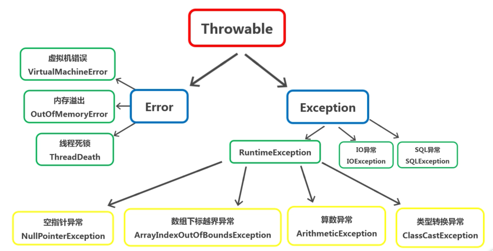

# Java异常
## 异常简介
### 异常 what？
 - 本质上是程序上的错误
 - 错误通常分为编译时期错误与运行时期错误
 - 在程序运行过程中，意外发生的情况，背离我们程序本身的意图的表现，都可以理解为异常。
### 异常分类
#### Throwable Java中异常的根类
1. Error 是程序无法处理的错误，表示运行应用程序中较严重问题
    - 常见错误，它们在应用程序的控制和处理能力之外，而且绝大多数是程序运行时不允许出现的状况
    - VirtualMachineError 虚拟机错误
    - OutOfMemoryError 内存溢出错误
    - ThreadDeath 线程死锁 
2. Exception 是程序本身可以处理的异常。异常处理通常针对这种类型异常的处理
    - Unchecked Exception 非检查异常
    - Chceked Exception 检查异常  
+ 
## 异常处理分类
- 异常处理机制 **抛出异常** **捕获异常**
- 通过5个关键词来实现：``try`` ``catch`` ``finally`` ``throw`` ``throws``
## 使用try...catch...finally实现异常
```
 try{
   //代码片段1
   //产生异常的代码段2
 }catch(异常处理 ex){
   //对异常进行处理的代码段3
 }finally{
   //代码段4
 }
```
- try块后可接零个或多个catch块，如果没有catch块，则必须跟一个finally块。
- 使用多重catch块
```
 try{
   //代码片段1
   //产生异常的代码段2
 }catch(异常处理 ex){
   //对异常进行处理的代码段3
 }catch(异常处理 ex){
   //对异常进行处理的代码段3
 }catch(Exception ex){
   //对异常进行处理的代码段3
 }finally{
   //代码段4
 }
```
- 终止finally执行的方法
```
System.exit(status);
```
- ``return``的使用  
finally语句中使用return，会强制返回return语句的内容
## 使用throw和throws实现异常
- 如果一个方法可能会出现异常，当没有能力处理这种异常，可以在方法声明处用throws子句来声明抛出异常
- throws语句用在方法定义时声明该方法要抛出的异常类型。
```
public void method() throws Exception1,Exception2,....ExceptionN{
  //可能产生异常的代码
}
```
- 当方法抛出异常列表中的异常时，方法将不对这些类型及其子类类型的异常进行处理，而是抛出调用该方法的方法，由它去处理
- 通过throws抛出异常时，针对可能出现的多种异常情况，解决方案：
    1. throws后面接多个异常类型，中间用逗号分隔
    2. throws后面接Exception
## 自定义异常
## 异常链
## 总结